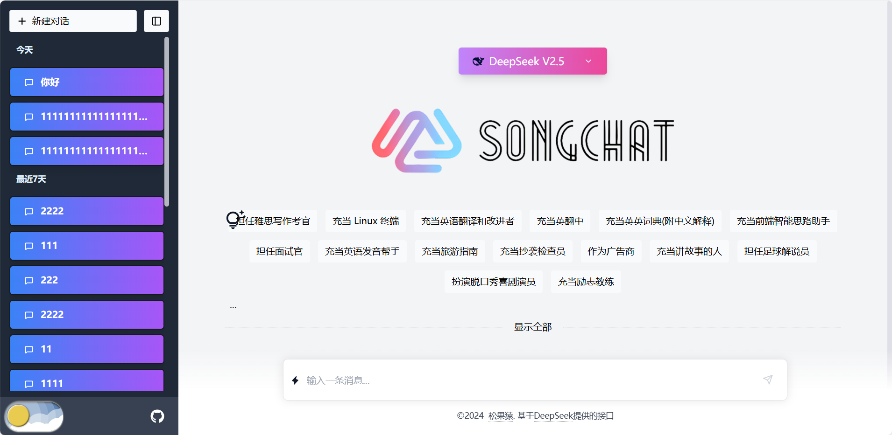

# SongChat 人工智能助手

本项目是一个基于 Next.js 全栈的 AI 人工智能助手项目，它调用了 DeepSeek 大模型接口，以提供聊天和对话功能。以下是项目的基本概述和技术栈。


## 项目截图


## 使用的技术

- **Next.js**：一个用于服务器端渲染和生成静态网站的 React 框架。
- **TailwindCSS**：一个实用优先的 CSS 框架，用于快速构建自定义设计。
- **Prisma**：一个用于 PostgreSQL 的 ORM，简化数据库交互。
- **PostgreSQL**：一个强大、开源的关系型数据库系统。
- **shadcn/ui**：一套可访问、可组合的 UI 组件集合。

## 快速开始

### 前提条件

- Node.js（推荐使用 LTS 版本）
- PostgreSQL 数据库

### 安装

1. 克隆仓库：

```
git clone https://github.com/songguo1/SongChat-Next-Tailwind.git
cd SongChat-Next-Tailwind
```

2. 安装依赖：

```
npm install
```

3. 设置环境变量：

​	在根目录下创建一个 `.env.local` 文件，并添加你的环境变量：

```
# 数据库连接信息
DATABASE_URL=postgres://用户名:密码@localhost:5432/你的数据库名

# Deepseek API配置
DEEPSEEK_API_Base_URL="https://api.deepseek.com"
DEEPSEEK_API_KEY=""
```

4. 设置数据库：

```
npx prisma migrate dev
```

5. 启动：

```
npm run dev
```

应用程序将运行在 `http://localhost:3000`。

## 使用说明

### Deepseek API 申请

- API key申请地址：https://platform.deepseek.com/api_keys
- API文档地址：https://platform.deepseek.com/api-docs/zh-cn/
- API定价信息：https://platform.deepseek.com/api-docs/zh-cn/pricing

> 当然你也可以使用其他大模型的api

### ORM

- 使用Prisma简化执行数据库操作。更多信息请参考 [Prisma 文档](https://www.prisma.io/)

### 样式

- 使用 TailwindCSS 类进行样式设计。更多信息请参考 [TailwindCSS 文档](https://tailwindcss.com/docs)。

### 组件

- 使用 `shadcn/ui` 组件构建 UI。组件使用说明请查阅 [shadcn/ui 文档](https://github.com/shadcn/ui)。

## 许可证

本项目使用 MIT 许可证 - 详情请查看 `LICENSE` 文件。

## 联系方式

如有任何问题或建议，请在 GitHub 上开一个问题

------

感谢您考虑使用本项目。祝您使用SongChat 愉快！🚀